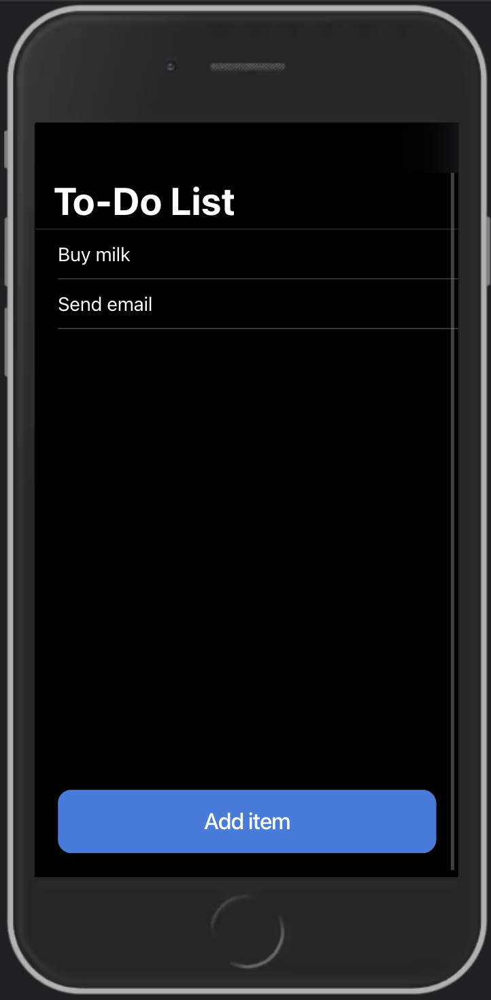
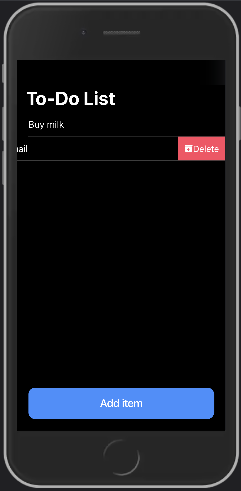
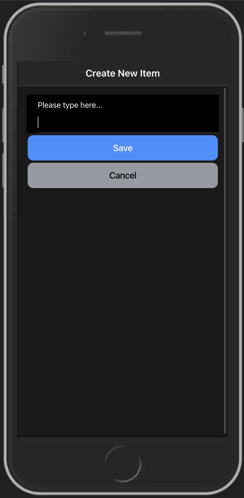

# To-Do List App

A basic to-do list app created in Ionic Vue.

## About this Project
This is my first venture into mobile development. The project is built using the Ionic Vue framework due to familiarity with VueJS, but also wanting to learn one of the most popular web development technologies - Ionic.

Due to this being my first app, it is simple and elegant. You are able to add items to your to-do list by clicking on the button that opens a modal. Data is currently stored in an array for simplicity. You are also able to delete items from your to-do list by sliding the item and clicking the delete button.

<div style="text-align:center">
    <br>
    
    
    
    <br>

</div>

## Set-Up
1. Install Ionic if needed
    ```
    npm install -g @ionic/cli.
    ```
2. Clone this repository
3. Install all packages
    ```
    npm install
    ```
4. Run on the web
    ```
    ionic serve
    ```